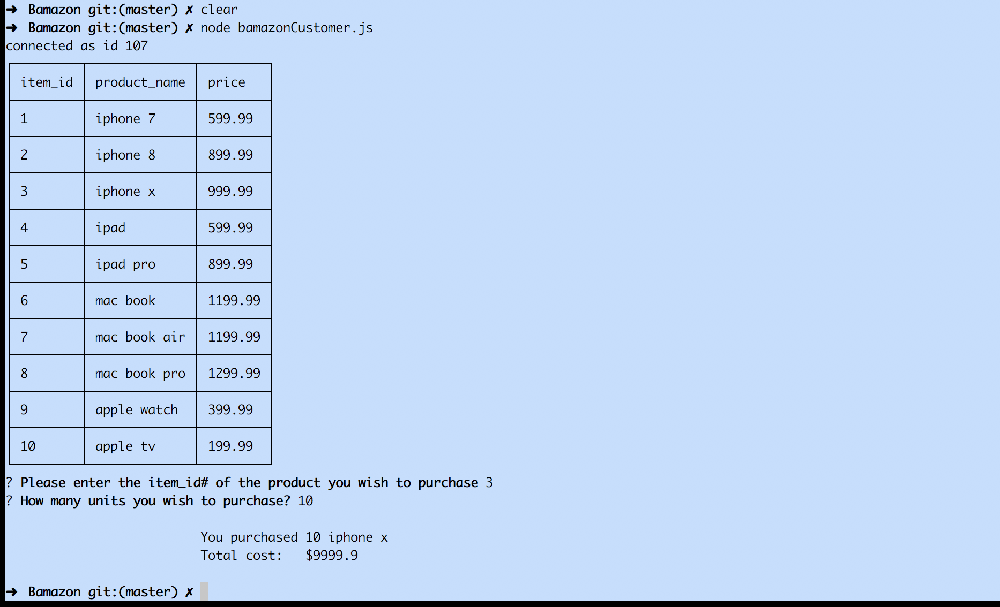

# Bamazon
### Synopsis
***
An interactive node app where mysql and node.js is used to create a user experience who can view and place an order as a customer.

####  Bamazon Customer Portal
***
Customer Portal allows the user to view current items available for purchase. User can view the items availble. User will then be prompted to add the item_id# and the quantity he would like to purchase. The app then checks to see if the item_id is correct and the item ordered is in stock.  If yes, it tells the total purchase amount to the user. If item_id is incorrect then it prompts user to enter correct id. If the item is out of stock then it tells the user sorry, can't process this order.
Once the order goes through the app then updates the quantity in the database.

##### Contributor
***
Navdeep Singh [GitHub](https://github.com/snavdeepsingh)

##### Technologies Used
***
* javascript
* node.js
* mysql
* npm packages :
                    - [mysql]
                    - [inquirer]
                    - [cli-table]

#### License
***

Copyright 2018 UT Coding Bootcamp - Navdeep Singh
